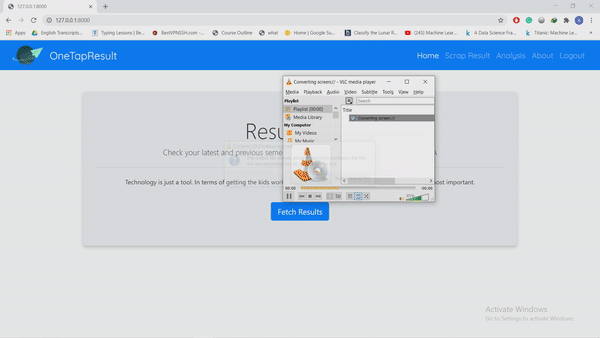

# VTU RESULT ANALYSIS
A web application which can bypass VTU result page without re-entering the USN and captcha again and again.Instead takes list of USN in xlsx file and fetches the result.
## FEATURES
* Detailed Analysis report.
* Report can be downloaded in xlsx format.
* Selection 
* Results are stored in MYSQL server.
## Requirement
* Python
* Django 2.21
* Internet Connection
## Installation
```
git clone https://github.com/UdPro/vtu_result_analysis.git
cd vtu_result
```
```
pip install -r requirements.txt
python manage.py check
python manage.py makemigrations
python manage.py migrate
python manage.py runserver 0.0.0.0
```
## Video



## Contributing
Feel free to submit a pull request or an issue!


